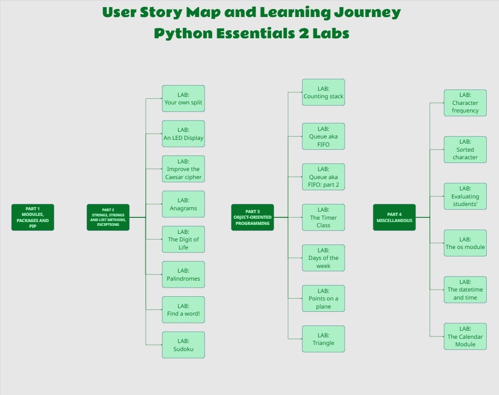

<div align="center">

  
</div>

# 🐍 PCAP Study Portfolio: Python Essentials 2

  *These studies and labs are dedicated to the Sacred Hearts of Jesus and Mary.* ❤️‍🔥🙏

  ---

<br/>


[](https://www.python.org/) 
 


## 📖 About this Repository Folder

This section of my study repository is dedicated exclusively to my solutions for the practical labs in the **Python Essentials 2** course.

The primary goal of this material is to deepen my knowledge of modules, packages, exceptions, string processing, and Object-Oriented Programming (OOP), while consolidating my preparation for the **PCAP (Python Certified Associate Programmer)** certification exam.

## 🧭 Quick Navigation

- 🎯 [Project Vision and Motivation](python-essentials-2#-project-vision-and-motivation)
- 🗺️ [Requirements & Agile Planning Overview](python-essentials-2#️-requirements--agile-planning-overview)
- 🔄 [Execution: GitHub Projects & Sprints](python-essentials-2#-repository-structure)
- 👷🏽‍♀️ [Lab Progress](python-essentials-2#-lab-progress)
- ⚖️ [Educational Notice](python-essentials-2#️-educational-notice)
``

## 🎯 Project Vision and Motivation

As a Systems Analyst transitioning into a **Software Engineer** role, I believe in treating study projects with the same rigor as production software. 

To reflect real-world development practices, this project bridges the gap between business requirements and technical implementation. Instead of simply writing scripts, I treated the course curriculum as a software product. My methodology includes:

*   **User Story Mapping:** Visualizing the learning journey across all course labs.

*   **Agile Execution:** Managing tasks via GitHub Projects (Kanban) using time-boxed Sprints.

*   **Requirements Analysis:** Documenting the logic and needs for every script before coding.

*   **DevOps Fundamentals:** Incorporating CI/CD pipelines, automated testing, and separation of concerns to ensure code quality.

## 🗺️ Requirements & Agile Planning Overview

This project is structured using standard Agile taxonomy to break down the complexity of the course into manageable, deliverable increments.

### 1. The Epic: Python Essentials 2 Labs

* **Goal:** Attain practical mastery of advanced Python concepts required for the **PCAP Certification**.
* **Scope:** All theoretical modules and practical laboratories within the Python Essentials 2 curriculum.

### 2. Features (The Backbone)
The Epic is divided into four main Features (represented by the **dark green blocks** in the User Story Map). These act as the major milestones of the learning journey:

* **Feature 1:** Part 1 - Modules, Packages, and PIP. Project structure and planning sprints.
* **Feature 2:** Part 2 - Strings, String and List Methods, Exceptions.
* **Feature 3:** Part 3 - Object-Oriented Programming (OOP) - *The core of the curriculum.*
* **Feature 4:** Part 4 - Miscellaneous (File I/O, OS, Datetime, Calendar).
* 
### 3. User Stories (The Deliverables)
Each Feature is broken down into specific User Stories, which are the actual programming labs (represented by the **light green blocks**). 

* Each User Story acts as a standalone requirement.
* Before coding, each story receives its own documentation detailing the **Business Logic** and **Acceptance Criteria**.

## 🔄 Execution: GitHub Projects & Sprints

To bring the User Story Map to life, execution is managed via a **[Kanban Board on GitHub Projects](https://github.com/users/anapaula-carmelita/projects/1/views/8)**.

1. **Backlog:** All labs (User Stories) start in the general backlog.
2. **Sprints:** Stories are grouped into thematic Sprints based on their parent Feature. 
3. **Workflow:** Tasks transition from *To Do* ➔ *In Progress* ➔ *Done* as the code is written, tested, and pushed to the repository.

This approach not only organizes the study flow but also simulates a real DevOps and Agile environment, ensuring continuous integration of knowledge.



## 🚀 What you will find here

The scripts and documentation are organized to demonstrate both coding and analytical skills. Here are the practical concepts applied:

- [ ] 📦 **Modules and Packages:** Creation, usage, and organization.
- [x] 🔤 **Strings:** Advanced text processing methods.
- [x] ⚠️ **Exceptions:** Error handling and building custom exception hierarchies.
- [x] 🧩 **Object-Oriented Programming (OOP):** Classes, methods, inheritance, and polymorphism.
- [x] 📁 **Files:** File I/O manipulation.
- [x] ⚙️ **Agile & DevOps:** Requirements analysis, automated testing, and CI/CD workflows.

## 📂 GitHub

### [Folder on GitHub](https://github.com/anapaula-carmelita/Estudos/tree/main/python/python-essentials-2)

### Folder Repository Structure 

```text
python-essentials-2/
│
├── assets/
│   └── user-story-map.jpg
│
├── part1/
│   └── ⏳
│
├── part2/            
│   ├── lab_01/  
|   |   ├── lab_01_myownsplit.py
|   |   ├── lab_01_unitest.py
│   |   └── README.md
│   |
│   ├── lab_02/ 
|   |   ├── lab_02_led_display.py
|   |   ├── lab_02_unitest.py
│   |   └── README.md
│   |
│   ├── lab_03/ 
|   |   ├── lab_03_caesar_cipher.py
|   |   ├── lab_03_unitest.py
│   |   └── README.md
│   |
│   ├── lab_04/
|   |   ├── lab_04_palindromes.py
|   |   ├── lab_04_unitest.py
│   |   └── README.md
│   |
│   ├── lab_05/      
|   |   ├── lab_05_anagrams.py
|   |   ├── lab_05_unitest.py
│   |   └── README.md
│   |
│   ├── lab_06/     
|   |   ├── lab_06_digitlife.py
|   |   ├── lab_06_unitest.py
│   |   └── README.md
│   |
│   ├── lab_07/
|   |   ├── lab_07_findword.py
|   |   ├── lab_07_unitest.py
│   |   └── README.md
│   |
│   ├── lab_08/     
|   |   ├── lab_08_sudoku.py
|   |   ├── lab_08_unitest.py
│   |   └── README.md
│   |
│   └── lab_21/    
|       ├── lab_21_readint.py
|       ├── lab_21_unitest.py
│       └── README.md
│
├── part3/   
│   ├── lab_09/  
|   |   ├── lab_09_stack.py
|   |   ├── lab_09_unitest.py
│   |   └── README.md
│   |
│   ├── lab_10/ 
|   |   ├── lab_10_queue.py
|   |   ├── lab_10_unitest.py
│   |   └── README.md
│   |
|   ├── lab_11/ 
|   |   ├── lab_11_queue.py
|   |   ├── lab_11_unitest.py
|   |   └── README.md
│   |
|   ├── lab_12/ 
|   |   ├── lab_12_timer.py
|   |   ├── lab_12_unitest.py
|   |   └── README.md
│   |
|   ├── lab_13/ 
|   |   ├── lab_13_weeker.py
|   |   ├── lab_13_unitest.py
|   |   └── README.md
│   |
|   ├── lab_14/ 
|   |   ├── lab_14_point.py
|   |   ├── lab_14_unitest.py
|   |   └── README.md
│   |
|   └── lab_15/ 
|       ├── lab_15_triangle.py
|       ├── lab_15_unitest.py
|       └── README.md
|
├── part4/      
│   ├── lab_16/  
|   |   ├── lab_16_histogram.py
|   |   ├── lab_16_unitest.py
│   |   └── README.md
|   |
│   ├── lab_17/
|   |   ├── lab_17_histogram_sorted.py
|   |   ├── lab_17_unitest.py
│   |   └── README.md
|   |
│   ├── lab_18/  
|   |   ├── lab_18_evalstudents.py
|   |   ├── lab_18_unitest.py
│   |   └── README.md
|   |
│   ├── lab_19/  
|   |   ├── lab_19_finddir.py
|   |   ├── lab_19_unitest.py
│   |   └── README.md
|   |
│   ├── lab_20/  
|   |   ├── lab_20_datetimeandtime.py
|   |   ├── lab_20_unitest.py
│   |   └── README.md
|   |
│   └── lab_22/  
|       ├── lab_22_countweekday.py
|       ├── lab_22_unitest.py
│       └── README.md
├── image_ia.png
|
└── README.md
```
## ✅ Lab Progress

### Part 2: Strings and Exceptions

- [x] [LAB-01 - Your own split](part2/lab_01)
- [x] [LAB-02: LED Display](part2/lab_02)
- [x] [LAB-03: Caesar Cipher](part2/lab_03)
- [x] [LAB-04: Palindromes ](part2/lab_04)
- [x] [LAB-05: Anagrams](part2/lab_05)
- [x] [LAB-06: Digit of Life](part2/lab_06)
- [x] [LAB-07: Find a Word](part2/lab_07)
- [x] [LAB-08: Sudokus](part2/lab_08)
- [x] [LAB-21: Reading ints safely](part2/lab_08)

### Part 3:  Object-Oriented Programming (OOP) - *The core of the curriculum.*
- [x] [LAB-09 - Counting Stack](part3/lab_09)
- [x] [LAB-10 - Queue (FIFO) - Part 1](part3/lab_10)
- [x] [LAB-11 - Queue (FIFO) - Part 2](part3/lab_11) [#102](https://github.com/anapaula-carmelita/Estudos/issues/102)
- [x] [LAB-12 - Timer Class](part3/lab_12) [#103](https://github.com/anapaula-carmelita/Estudos/issues/103)
- [x] [LAB-13 - Points on a Plane](part3/lab_13) [#104](https://github.com/anapaula-carmelita/Estudos/issues/104)
- [x] [LAB-14 - A Point on a Plane (Distance)](part3/lab_14) [#105](https://github.com/anapaula-carmelita/Estudos/issues/105)
- [x] [LAB-15 - Triangle Class](part3/lab_15) [#106](https://github.com/anapaula-carmelita/Estudos/issues/106)

### Part 4: Miscellaneous (File I/O, OS, Datetime, Calendar).

- [x] [LAB-16 - Character Frequency Histogram](lab_16) [#96](https://github.com/anapaula-carmelita/Estudos/issues/96)
- [x] [LAB-17 - Sorted Character Frequency Histogram (File Output)](lab_17) [#97](https://github.com/anapaula-carmelita/Estudos/issues/97)
- [x] [LAB-18 - Evaluating Students' Results](lab_18) [#98](https://github.com/anapaula-carmelita/Estudos/issues/98)
- [x] [LAB-19 - Find a Directory!](lab_19) [#107](https://github.com/anapaula-carmelita/Estudos/issues/107)
- [x] [LAB-20 - Formatting Date and Time](lab_20) [#99](https://github.com/anapaula-carmelita/Estudos/issues/99)
- [x] [LAB-22 - Counting Weekdays in a Year](lab_22) [#108](https://github.com/anapaula-carmelita/Estudos/issues/108)
  
## ⚖️ Educational Notice

This repository contains my own implementations, tests, and technical
documentation developed for educational purposes.

It is not an official Python Institute repository and does not replace the
course materials. Original exercise statements are not reproduced here.

